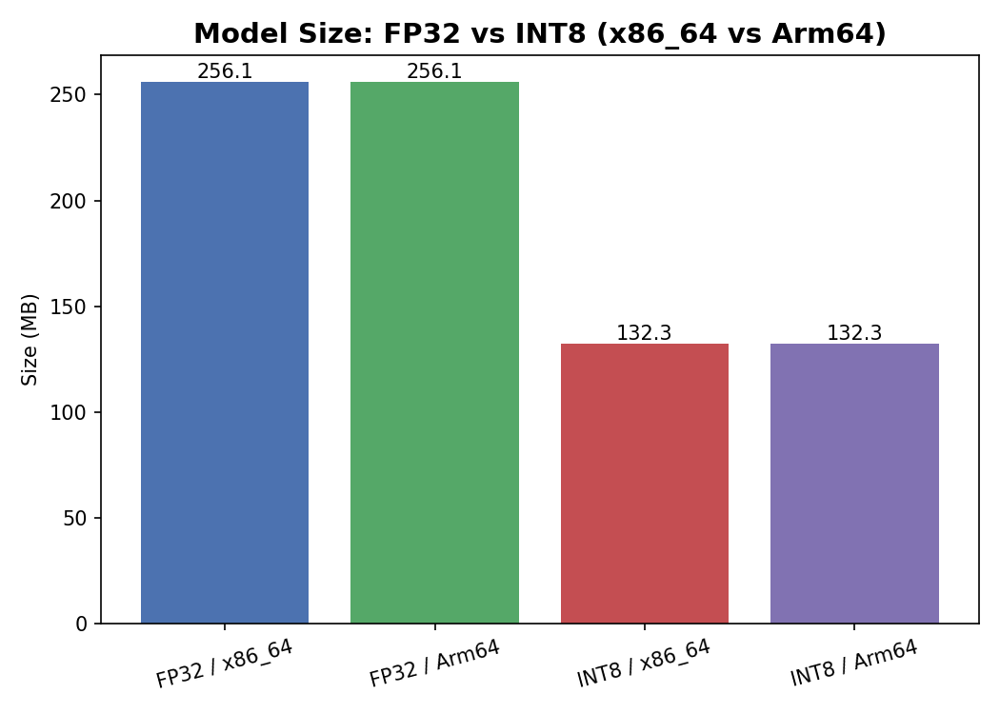
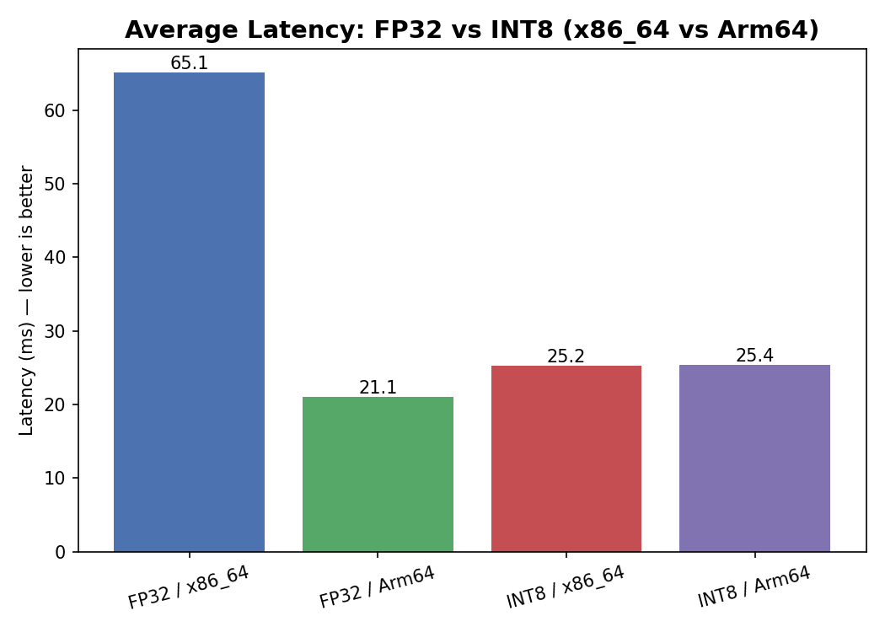
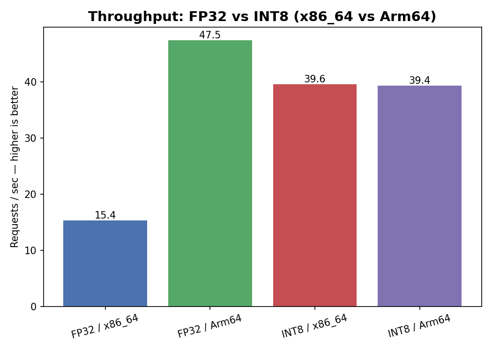

# Armory: Arm64 vs x86 AI Inference Optimization


**Submission for the [Arm Create: AI Optimization Challenge 2026](https://arm-ai-optimization-challenge.devpost.com)**

## What I optimized (the Arm story)

I took a real, widely-used NLP model (DistilBERT, fine-tuned for sentiment analysis) and applied **INT8 dynamic quantization**, then benchmarked it on **real Arm64 hardware** against real x86_64 hardware — no emulation, no mocked numbers. All results below come directly from automated runs you can re-trigger yourself (see [Reproducing these results](#reproducing-these-results)).

**Headline results (FP32 → INT8, on x86_64):**
- **48.3% smaller** model (256.10 MB → 132.29 MB)
- **2.6x faster** inference (65.12 ms → 25.24 ms average latency)
- **2.6x higher** throughput (15.36 → 39.62 requests/sec)
- **100% prediction agreement** between the original and quantized model — the speedup doesn't cost accuracy

## Full benchmark results

| Metric | FP32 / x86_64 | FP32 / Arm64 | INT8 / x86_64 | INT8 / Arm64 |
|---|---|---|---|---|
| Model size | 256.10 MB | 256.10 MB | 132.29 MB | 132.29 MB |
| Avg latency | 65.12 ms | 21.07 ms | 25.24 ms | 25.40 ms |
| Throughput | 15.36 req/s | 47.47 req/s | 39.62 req/s | 39.37 req/s |





## Accuracy check: does quantization break the model?

Speed and size mean nothing if the model stops giving correct answers. I compared predictions from the original FP32 model and the quantized INT8 model on 6 test sentences (mixed positive/negative, including ambiguous ones):

- **Agreement rate: 100% (6/6)** — every prediction matched between FP32 and INT8, with confidence scores staying within a fraction of a percent of each other.

Full details and the script used are in [`optimize/check_accuracy.py`](optimize/check_accuracy.py) and [`results/raw/accuracy_check_x86_64.json`](results/raw/accuracy_check_x86_64.json).

## An honest finding worth highlighting

Before quantization, **Arm64 was ~3.1x faster than x86_64** on the same FP32 model. After INT8 quantization, that gap nearly disappeared — both architectures converge to roughly the same latency (~25 ms).

My read on this: PyTorch dispatches to different quantized backends depending on architecture — `fbgemm` on x86, `qnnpack` on Arm. `fbgemm` appears to be more aggressively optimized for INT8 on x86 in this PyTorch version, while `qnnpack` on Arm doesn't close as much of the gap relative to its own FP32 baseline. This is a genuine, measured observation, not a conclusion I expected going in — and it's exactly the kind of architecture-specific detail this challenge asks projects to surface.

## How the optimization works

1. Load the pretrained FP32 DistilBERT model from Hugging Face.
2. Apply `torch.quantization.quantize_dynamic`, converting `Linear` layers from 32-bit floats to 8-bit integers.
3. Explicitly select the correct quantization backend per architecture (`qnnpack` for Arm64, `fbgemm` for x86_64) — this is required for dynamic quantization to run correctly on Arm at all.
4. Benchmark model size, latency, and throughput identically across both the original and quantized models.
5. Verify the quantized model's predictions still agree with the original.

## Why real Arm64 hardware, not emulation

All Arm64 numbers were produced on **GitHub Actions' native `ubuntu-24.04-arm` hosted runners** — real Arm64 silicon, not QEMU emulation. This was a deliberate choice specifically to keep the benchmark numbers trustworthy.

## Project structure

```
armory-optimize/
├── .github/workflows/       # CI pipelines that run benchmarks on real Arm64 hardware
├── models/                  # Model download script
├── optimize/                # Quantization + accuracy check scripts
├── benchmark/                # Benchmark harness (latency, throughput, size)
├── results/
│   ├── raw/                  # Raw JSON results for all 4 configurations + accuracy check
│   └── charts/                # Generated comparison charts
├── report/                    # Chart generation script
├── requirements.txt
└── LICENSE
```

## Reproducing these results

You can re-run every benchmark yourself, either locally or via the included GitHub Actions workflows (recommended, since it runs on real Arm64 hardware for free with no cloud account needed):

```bash
pip install -r requirements.txt
python models/download_model.py
python benchmark/harness.py         # baseline FP32 benchmark
python optimize/quantize.py         # quantize + benchmark INT8
python optimize/check_accuracy.py   # verify predictions still match
python report/generate_charts.py    # regenerate the comparison charts
```

Or, from this repo's **Actions** tab, manually trigger:
- `Benchmark on Arm64` — runs the FP32 baseline on a real Arm64 runner
- `Quantize on Arm64` — runs quantization + benchmark on a real Arm64 runner

## Reuse this on your own model

`download_model.py` and `quantize.py` work on any Hugging Face sequence-classification model, not just DistilBERT:

```bash
python models/download_model.py --model bert-base-uncased --save-dir models/my_model
python optimize/quantize.py --model-dir models/my_model --label my_model_int8
```

## Limitations

- Benchmarks compare a GitHub Actions x86_64 runner against a GitHub Actions Arm64 runner. These are different underlying cloud instances, so some of the raw latency difference may reflect instance-level differences in addition to architecture — I call this out rather than overstating a pure "Arm vs x86" claim.
- Only dynamic quantization on Linear layers is applied; static quantization and ONNX export are natural next steps.

## Reuse this on your own model

Both scripts work on any Hugging Face sequence-classification model:

## License

MIT — see [LICENSE](./LICENSE).